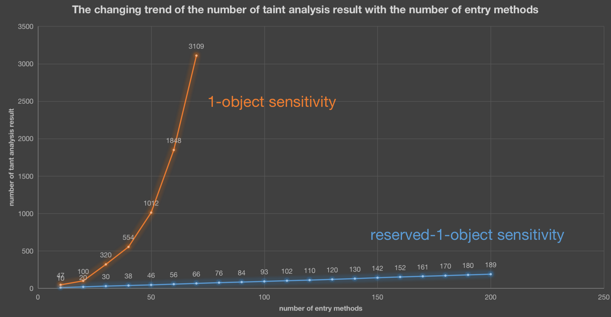
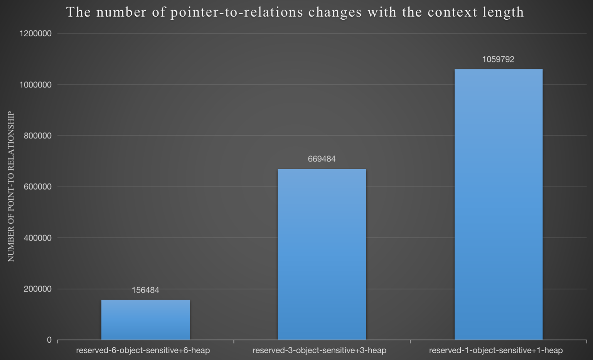
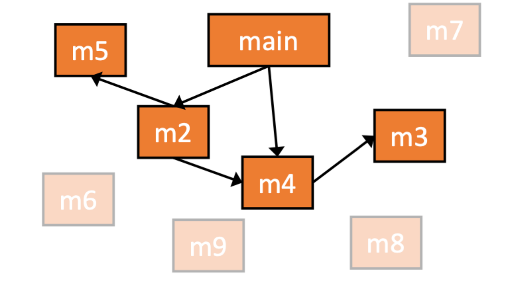
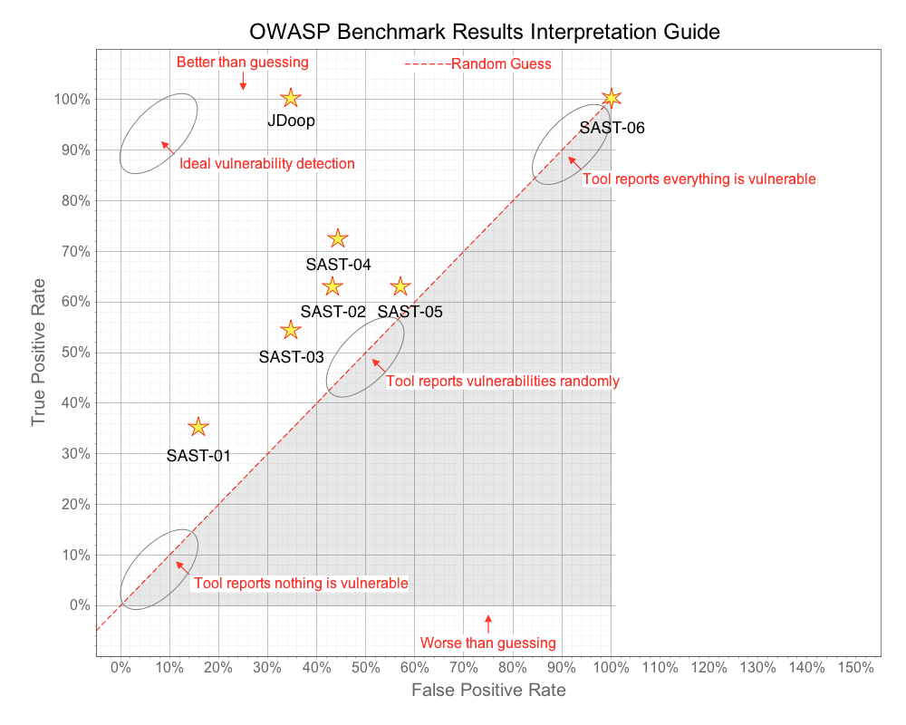

‍

## 1. Introduction

We believe that various types of Java vulnerabilities can essentially be summarized into two issues

1. Data flow problem: Untrustworthy data flows to some dangerous functions
2. Data filtering problem: omissions occurred when filtering untrusted data

The second problem is too complex and can only be identified by humans and is difficult to automate; JDoop project attempts to solve the first problem

JDoop is improved based on [Doop framework](https://github.com/plast-lab/doop-mirror). 

The general structure is as follows. 

1. soot decompiles the bytecode into IR
2. fact-generator extracts Facts from the IR.
3. finally the datalog rules and facts are submitted to the souffle engine for solving. Datalog rules include pointer analysis rules and taint analysis rules

```java
         +---------------+
         | Java ByteCode |
         +------┬--------+
                |
                |Soot
                V
            +---------+
            |Jimple IR|
            +---┬-----+
                |
                |fact-generator
                V
             +------+           +---------------+
             |facts |           |Datalog rules  | 
             +--┬---+           +----┬----------+
                |                    |
                |                    |
                |       solver       |
                |     +--------+     |
                +---->|Souffle |<----+
                      +---┬----+
                          | 
                          |
                          V
                    +---------------+
                    |AnalysisResult |
                    +---------------+
```

The reasons for choosing this technical stack are as follows:

1. Datalog rules and pointer analysis rules are naturally compatible and highly consistent. Compared with the analysis method written in Java, it is more concise and clear.
2. We can decouple the solution and analysis rules, so we no longer need to worry about the solution when writing analysis rules, and we can effectively utilize Souffle's multi-core solution capabilities to improve analysis efficiency.

We have mainly improved the datalog rules part. The following is a detailed introduction

‍

‍

## 2. Improve PT Analysis algorithm

PT Analysis algorithm original paper: [Unified Points-to and Taint Analysis](https://yanniss.github.io/ptaint-oopsla17-prelim.pdf)

‍

### 2.1 introduction to PT Analysis

The PT Analysis algorithm proposes: During taint analysis, treat the tainted object generated by the source point as an normal heap object, so that the tainted object is propagated together with the other heap object. In this way we can reuse the original pointer analysis rules and there is no need to write additional rules for mechanisms such as lambda and reflection.  At the same time, because the type of tainted objects may change when they are propagated, for example, the String type changes to the `byte[]`​ type, the author also proposed the concept of taint transfer to deal with the problem of transferring tainted objects.

We need to focus on the taint transfer. Assume that there is the following code, in which `str`​ points to a taint object of type `String`​. The `byte[]`​ array returned after calling `getBytes()`​ is also tainted, so a taint transfer rule is added to model the `String.getBytes()`​ method: if the str pointer points to the taint object, a taint object of type `byte[]`​ is returned, and the `arr`​ pointer also points to Taint object

```java
String str = source();
byte[] arr = str.getBytes();
```

‍

### 2.2 Limitations of taint transfer

Then in actual practice, I found that taint transfer has some limitations, such as the following example

```java
String str = source();

// convert to char array
char[] arr = new char[8];
str.getChars(0, 8, arr, 0);

// get element from char array
char arr2 = new char[8];
arr2[0] = arr[0];

// convert char array to String object
String str2 = new String(arr2);
sink(str2);
```

If we set a taint transfer of type `base=>arg`​ for the `String::getChars()`​ method, then `arr`​ will point to the taint object of type `char[]`​. However, taint transfer does not set any point-to relations for the internal elements of the array, so `arr[0]`​ does not point to any object, causing the taint stream to be interrupted.

In other words, the taint object generated after the taint transfer is an empty shell with nothing inside, and no attention is paid to the taint object. It does not handle the point-to relations of the generated object's internal fields or indexes.

Let’s take another example: the following are two taint transfer rules for LinkedList in Doop. taint transfer will generate a taint object of type `LinkedList`​, The internal fields of the generated `LinkedList`​ object do not have any point-to relations

```java
ParamToBaseTaintTransferMethod(0, "<java.util.LinkedList: boolean add(java.lang.Object)>").
BaseToRetTaintTransferMethod("<java.util.LinkedList: java.lang.Object get(int)>").
```

so How should we deal with internal fields when apply taint transfer? 

‍

### 2.3 Improve taint transfer

I think we should: limit the types of tainted objects and only focus on tainted objects of `String, char`​ and other types. These types themselves are tainted data, rather than having only a certain field pointing to the tainted object. **Treat it as a an indivisible atom, taint transfer and the analyzed program are regarded as a bridge to propagate these tainted objects**. Only methods with return value types of `String, char`​ and other types are modeled using taint transfer. Examples are as follows:

```bash
BaseToRetTaintTransferMethod("<java.lang.String: java.lang.String toLowerCase()>").
BaseToRetTaintTransferMethod("<java.lang.String: java.lang.String toLowerCase(java.util.Locale)>").
BaseToRetTaintTransferMethod("<java.lang.String: java.lang.String toUpperCase(java.util.Locale)>").
BaseToRetTaintTransferMethod("<java.lang.String: java.lang.String toUpperCase()>").
BaseToRetTaintTransferMethod("<java.lang.String: java.lang.String trim()>").
```

In this way, taint transfer will not generate taint objects with complex types(such as LinkedList), but will only generate simple types of taint objects such as `String and char`​. We do not need to care about the point-to relations of the internal fields of the taint objects generated by taint transfer (because these types are  atomic, We won't access its internal fields)

How to deal with the situation where a certain field of the return value contains tainted objects, such as `LinkedList`​? Bring the method into the scope of analysis and then hand it over to pointer analysis.

For example, for the container classes in JDK, I modified their implementation in JDK to make them easier to analyze (also called mock JDK), so that pointer analysis will automatically handle the point-to relations within `LinkedList`​. Assume `LinkedList ​`​is mocked as follows

```java
class LinkedList{
    String[] arr;

    public LinkedList() {
        this.arr = new Object[1];    // listObj.<arr> -> { arrObj }
    }

    public void add(String ele){
        this.arr[0] = ele;
    }

    public String get(int idx){
        return this.arr[idx];
    }
}

// create LinkedList object
LinkedList list = new LinkedList();    // list->{ listObj }

// 污点对象传播
String str = source();    // str points to taintObj
list.add(str);
sink(list.get(0));
```

The process of pointer analysis is as follows

1. for `list = new LinkedList()`​

    1. get point-to relations: `list->{listObj}`​
    2. analyse constructor method, get point-to relations: `listObj.<arr> -> { arrObj }`​
2. for `list.add(str)`​: Since `this.arr`​ points to the object `arrObj`​, after analyzing `this.arr[0]=ele`​, we get the point-to relations: `arrObj[*] -> { taintObj}`​
3. For `list.get(0)`​: Since `this.arr`​ points to the object `arrObj`​, so `arrObj[*] -> {taintObj}`​, thus the taint flow is established

In the whole process, the `LinkedList`​ object is only used as a bridge to propagate tainted objects of String type. LinkedList type objects themselves will not be tainted. This is also true for some classes written by users.

This has two benefits:

1. The methods of container classes in JDK are very complex, such as iterators, lambdas, streams, etc. These semantics cannot be expressed through simple taint transfer rules, so taking them into the scope of pointer analysis instead of crudely returning a big tainted Object can improve accuracy and reduce false positive
2. We only need to mock JDK and include the relevant code in the analysis. It is simpler and more convenient than writing taint transfer. In fact, we only need to process a small part of the classes in the JDK.

To sum up: 

1. Atomize the taint object to avoid the type of taint object being too complex, which is more in line with the idea of PT Analysis and facilitates pointer analysis.
2. For taint transfer, we should try to include the code of this method into the scope of analysis.

‍

‍

## 3. Improve context-sensitive strategy 

In context-sensitive analysis,  context-sensitive strategy means how to choose context elements for called method. 

Currently there are the following strategies

* Call-Site Sensitivity: Use the method call site as the context element of the called method
* Object Sensitivity: Use the receiver object of the method call as the context element of the called method
* Type Sensitivity: Use the class of the method that created the receiver object as the context element of the called method

In dynamic execution, each method call generates a new call frame and pushes it into the call stack. The entire call stack serves as the context of the currently executed method.

A context element is equivalent to the abstraction of a call frame. We can combine multiple context elements to form the context of the called method. It is easy to find: the more elements contained in the context, the better it can simulate the real execution situation. but obviously It is impossible to record the entire call stack, because there may be infinitely many, so for efficiency reasons, only a limited number of context elements can be used as the context of the called method, such as the 3-callsite strategy: use the last 3 call sites as the context of the called method, and the earlier ones will be discarded

The n-object-sensitive strategy is usually used when analyzing Java programs. Then when analyzing Java web programs, we found that the traditional context-sensitive strategy did not perform well. We analyzed the reasons and made some significant improvements.

‍

### 3.1 Choose more distinguishing context elements

In actual analysis, we found that the distinctiveness of different context elements is very different. **We should selectively reserve those more distinctive elements within the limited context length**, rather than following the traditional first-come, first-served principle.

The example is as follows. Assume that the traditional context-sensitive strategy of `1-obj+1-heap`​ is adopted, where T1 and T2 are two entry classes respectively. We create `HttpServletRequest`​ object for the `req1`​, `req2`​ pointers in `doGet()`​ respectively.

* For `Cookie cookie1 = req1.getCookie("...")`​, `getCookie()`​ creates an object of type `Cookie`​, we record it as `cookieObj`​, and its heap context is `reqObj1`​, so there is `cookie1->[reqObj1]:cookieObj`​
* For `Cookie cookie2 = req2.getCookie("...")`​, the same as above, there is `cookie2->[reqObj2]:cookieObj`​, because there is heap context distinction, so there is no confusion at this time

* For `cookie1.getValue()`​, since the context can only hold one element, `reqObj1`​ in the context `[reqObj1]`​ is replaced by `cookieObj`​ which pointed to by `cookie1`​, so the context of the `getValue()`​ method is `[cookieObj]`​.
* For `cookie2.getValue()`​, due to the limited context elements, the context of this method is `[cookieObj]`​

So far we have discovered that due to insufficient context length, the contexts of the two calls of `cookie1.getValue()`​ and `cookie2.getValue()`​ become the same, which leads to confusion in the data flow.

```java
class T1{
    void doGet(HttpServletRequest req1, ...){    // req1 -> {reqObj1}
        Cookie cookie1 = req1.getCookie("...");     // cookie1 -> [reqObj1]:cookieObj
        String value1 = cookie1.getValue();    // Since the context can only hold one element, the context of the getValue() method is [cookieObj]
        ...
    }
}

class T2{
    void doGet(HttpServletRequest req2){    // req2 -> {reqObj2}
        Cookie cookie2 = req2.getCookie("...");     // cookie2 -> [reqObj2]:cookieObj
        String value2 = cookie2.getValue();    // Since the context can only hold one element, the context of the getValue() method is [cookieObj]
        ...
    }
}
```

Although this problem can be solved by increasing the context length, we cannot increase the context length without limit. So is there any way to avoid data flow confusion without increasing the context length?

Intuitively, we should isolate the data flow of different entry methods, because the two entry methods process HTTP requests independently\, so it is best to keep element about the entry method or entry class in the context, so we can ensure that no matter how deep the call stack is, there will never be taint flow confusion between different entry methods.

Suppose retain `reqObj1`​ and `reqObj2`​ when selecting context elements, what will happen?

* For `cookie1.getValue()`​, the original context is `[reqObj1]`​. Since `reqObj1`​ is more distinctive, soreserve this element and discard `cookieObj`​, then the context of the `getValue()`​ method in this call is`​ [reqObj1]`​
* For `cookie2.getValue()`​, the original context is `[reqObj2]`​. Since `reqObj2`​ is more distinctive, we retain this element and discard `cookieObj`​ too, then the context of the `getValue()`​ method in this call is`​ [reqObj2]`​

When actually analyzing the Java web program, I chose to retain the context elements related to the entry class to avoid confusion of data flow between different entry classes.

In this way, we avoid confusion through the selection of context elements while the context length remains unchanged. I called this selective context selection strategy as *reserved context sensitive strategy*

Here is a comparison between traditional context strategy and *reserved context sensitive strategy ​*(The x-axis represents the number of randomly selected entry methods from the owasp benchmark)

​​

‍

discover:

* ​`1-obj-1-heap sensitive stragety`​:  The number of analysis results varies as the square of the number of entry points. typeically,  one entry point corresponds to at most one analysis result. Square-level growth means that the data flows between different entry points are confused with each other, resulting in a large number of false positives.
* ​`reserved-1-object sensitive strategy`​: The number of analysis results increase linearly with the number of entry points, indicating that the data flows of each entry point are effectively distinguished. Dramatically reduce false positives

To sum up: Traditional Java programs have only one main entry class point, but Java web applications have hundreds or thousands of entry points, so it is very effective to use entry points to distinguish data flows in Java web programs.

‍

‍

### 3.2 Context length

For pointer analysis, the longer the context length, the more pointers have to be analyzed since pointers in different contexts are considered different. Assuming that n pointers are to be analyzed when context is independent, then when the context length is k, the total The pointer to be analyzed is approximately `k*n`​

Therefore, the context element length selected for most pointer analysis is 1~3, even in order not to enable context sensitivity to reduce the analysis pressure. 

However, experiments have found that when using the PT Analysis algorithm to perform taint analysis on Java web programs, **the shorter the context length, the more complex the analysis is** (the number of pointer-point-to relations increases). The following is the change of the number of point-to relations with the context length.

​​

Why is there such an abnormal phenomenon?

Suppose there are n entry points to analyze. Ideally, each entry point corresponds to a taint flow from source to sink, then we will get n taint flows.

* Suppose we adopt context-free analysis and all taint streams are mixed together, then we will get `n^2`​ taint analysis result, and the point-to relations to be analyzed will also grow at the rate of `n^2`​
* Suppose we take the context of k elements and effectively distinguish all taint streams, then we will only get `n`​ taint analysis result, and the point-to relations to be analyzed grow at the rate of `k*n`​

The speed of linear growth is much smaller than the speed of square growth, so we should increase the context length to reduce data flow confusion as much as possible, because the overhead caused by increasing the context length is much smaller than the overhead caused by taint flow confusion.

When analyzing real-world components [jimureport](https://github.com/jeecgboot/JimuReport):

* If the context length is 3, I will get `32`​ taint analysis result and `548761`​ point-to relations
* If the context length is 6, I will only get `2`​ taint analysis result and the number of point-to relations is reduced to `161513`​, a decrease of 70%,

This shows that avoiding tainted stream confusion not only reduces false positives but also reduces analysis pressure.

Summary: For pointer analysis, the increase in context length will indeed increase the pointer analysis overhead; but in taint analysis, taint flow confusion will cause the pointer analysis to increase quadratically and lead to a large number of false positives, so we should increase the context length to avoid this happening.

‍

‍

## 4. Make JDK easier to analyze

We can roughly divide classes to be analyzed into three parts

* Application class: All this part needs to be analyzed. These are the entrances to the analysis.
* Dependency class: the classes in the dependent components of the application program. For this part, only the classes used by the application class will be analyzed, not all of them.
* Platform class: Mainly classes defined in JDK, How to deal with then?

For Platform class, let us first consider two extreme cases

1. Analyze everything: The test found that the classes in jdk are very complicated, and the call stack and reference relations are very deep. If take all into analysis, most of the time will be wasted on analyzing Platform class;
2. Analyze nothing: Although this can greatly reduce the complexity of analysis, the false negatives caused are unacceptable.

It has been observed that although there are many classes in jdk, they also follow the 2-8 principle. Classes which be frequently used (such as `String`​ and `HashMap`​) are only a small part. Most of them are rarely used. for dataflow analysis Most classes are noise classes that only increase the time required for analysis (such as `AbstractChronology`​)

Based on the above observations, the solution: **mock a small number of frequently used classes in jdk. During analysis, only those mocked classes are allowed to be analyzed**, and other classes are regarded as noise classes and ignored. Thus, a good balance is achieved between analysis every platform classes and analysis none platform classes

At present,  I mock 43 classes in jdk , such as `String`​, `HashMap`​, `HashSet`​ and other highly frequently used classes. During analysis, only these classes will be included in the analysis scope. This method not only did not lead to false negatives but also effectively avoided the issue of excessive analysis time caused by analysising complex classes in the JDK.

‍

## 5. adapt to spring framework

### 5.1 implicitly reachable methods

During the process of soot decompiling bytecode into IR, I found a problem in soot that causes false negatives

In addition to decompilation, Soot also has simple static analysis capabilities. When decompiling to IR, soot will start processing from the entry point main, and use CHA or spark to perform simple pointer analysis to calculate the set of reachable methods, such as `m5, m2, m4, m3`​ here. After that, Soot will only decompile those reachable methods and unreachable methods will not be processed. For example, `m6, m7, m8, m9`​ will be ignored

​​

‍

This is an effective optimization strategy that effectively reduces the pressure of subsequent analysis, but what if the soot analysis is wrong? When soot thinks that some actually reachable methods are unreachable and discards them, it will lead to false negatives.

For example, method `m3`​ refers to method `m7`​ through reflection.

```java
public void String m3() {
    ...
    Method m = clazz.getMethod("m7", ...);
}
```

Or method `m8`​ is the entry method of the spring framework. If this method is referenced through the spring framework, Soot will also consider it unreachable during analysis, resulting in false negatives.

```java
@RestController
public class Test{
    @PostMapping(value = "/m8")
    public String m8(@RequestParam String jsonStr) {
        ...
    }
}
```

Someone on [stack overflow](https://stackoverflow.com/questions/63298805/how-can-i-get-a-precise-callgraph-for-a-web-application-using-spring-framework-b) has asked a similar question, but the Soot team has not solved it.

My solution: Before Soot decompilation, I used Soot to conduct an additional pre-analysis. The purpose of this pre-analysis is to analyze those implicitly reachable classes\/methods and specify those as the classes\/methods to be decompiled later to solve the problem of losing reachable classes when soot analyzes the spring framework.

So how does this pre-analysis identify implicitly reachable methods?

This pre-analysis is very simple and fast. it will not perform any pointer analysis, it will directly convert all bytecodes into IR, Then perform two scans

1. For Spring framework: Traverse all classes and methodes, if it is found that this class\/method has annotations related to spring framework, it is considered to be reachable and will be added to the class\/method to be decompiled later.
2. For reflection: Traverse all string constants and check whether the string constant is a class\/method name. If so, it is considered that the class\/method may be accessed through reflection and will be added to class\/method to decompiled later

Spring can be configured through configuration files, annotations, and Java code. Currently, I have only dealt with the annotation situation, which can cover most situations. 

‍

### 5.2 Bean

During actual execution, the creation of beans and the management of dependencies between beans are handled by the Spring framework. the framework is very complex, it is impossible to start analysis directly from the framework itself. The best strategy is: write datalog rules to simulate the behavior of the framework, start the analysis directly from the Bean, ignoring the Spring framework itself.

To simulate framework behavior, the first thing to do is to identify and create Bean objects. Currently, my identification method is: look for classes annotated with `@Component`​, `@Controller`​, etc., identify these classes as Bean, and write rules to create objects of classes. 

This idea refers to the paper: [Static Analysis of Java Enterprise Applications](https://yanniss.github.io/enterprise-pldi20.pdf)

After creating the beans, the next step is to simulate the dependency injection mechanism and handle the dependencies between beans. Currently, the following three dependency injection methods are supported.

* `@Autowired`/`@Resouce`​ on Field: Search dependent Bean objects based on field types, and set point-to relations of  object field
* `@Autowired`/`@Resouce`​ on constructor parameter: Search the corresponding Bean object according to the parameter type of the constructor, and set the point-to relations of the constructor parameters
* `@Autowired`/`@Resouce`​ on setter method: Search the corresponding Bean object according to the parameter type of the setter method, and set the point-to relations of the setter method parameter.

By simulating the Spring framework we can avoid analyzing the code in the Spring framework. 

The Spring framework is a complex framework with many configuration methods and APIs. I currently only deal with the most commonly used ones.

‍

### 5.3 Create taint objects for entry method parameters

For the servlet framework, the parameters of the entry method can only be of type `HttpServletRequest`​, and we only need to create the taint object in this class. However, the parameters of entry method in Spring framework can be of any type, and the Spring framework will automatically create object for the parameters. At this point the situation becomes complicated

Let’s look at the simplest case first. When the entry parameter type is `String`​, obviously `str`​ should point to a tainted object of type `String`​.

```java
    @GetMapping(value = "/t1")
    public String t1(String str) {
        ...
    }
```

If the parameter type is Map, according to the previous theory, we cannot simplely create a taint object of type `Map`​(because of access path problem).  The correct approach is to create a `Map`​ type object, and make the key and value in the object point to taint object of `String`​ type.

```java
    @GetMapping(value = "/t2")
    public String t2(@RequestHeader Map<String,String> header) {
        ...
    }
```

Then the situation is more complicated. How to deal with the case where the entry class parameter is of Pojo type?  

For example:

```java
public class User {
    public String name;
    public int age;
    ...
}


public class User2 {
    public User user;
}

public class EntryClass {
    // spring framework will create object of User2 according HTTP request 
    // and call this entry method to handle it
    @PostMapping(value = "/t3")
    public User t3(@RequestBody User2 user2) { 
        sink(user2.user.name);
    }
}
```

According to the previous discussion on taint transfer, we cannot simply create a taint object of type `User2`​, which will cause access path problems. The correct approach is to recursively traverse all fields in User2 and handle them according to the type of field:

* If the field type is still a Pojo (such as `User`​), create an object of this type and recursively process the fields inside the object
* If the field type is `String`​, or `char`​, then the recursion should be stopped and make these fields point to the tainted object

For the above example, it will be considered that `user2.user.name`​ points to a tainted object of type `String`​, and objects of type `User2`​ and `User`​ are just bridges for passing tainted objects.

Currently supports entry parameters of `String, String[][]..., char[][]..., Map, Set, List, Pojo, JSONObject, JSONArray`​ types

Finally, after the above processing, JDoop can discover the template injection vulnerability [CVE-2023-4450](https://nvd.nist.gov/vuln/detail/CVE-2023-4450) in the [jimureport](https://github.com/jeecgboot/JimuReport) component

‍

## 5. Compare

The following are the test results conducted on 2708 command injection vulnerability samples in owasp benchmark v1.1. It contains 1802 real samples and 906 fake samples

The precision and recall rates are as follows

```java
True Positive = 1802
True Negative = 583
False Positive = 323
False Negative FN = 0

True Positive Rate = 100.00%
False Positive Rate = 35.65%
Score = 64.35%
Precision = 84.80%
Recall = 100.00%
```

The test environment and resource consumption are as follows:

```bash
Number of taint analysis: 2125 
Number of point-to relations: 2345192
Memory Usage: 14G
Total time spent: 219s
    - facts generatation: 71s
    - souffle solution: 148s
```

For comparison, the scores of other tools in the command injection sample are as follows, [Data source](https://github.com/OWASP-Benchmark/BenchmarkJava/blob/master/scorecard/Benchmark_v1.1%2C1.2_Scorecard_for_Command_Injection.html )

|Tool|Benchmark Version|TP|FN|TN|FP|Total|TPR|FPR|Score|
| ---------| -------------------| ------| ---------------| ------| ---------------| -------| ---------------| ---------| ---------------|
|JDoop |1.1|1802|583|323|0|2708|100.00%|35.65%|64.35%|
|SAST-01|1.1|638|1164|740|166|2708|35.41%|18.32%|17.08%|
|SAST-02|1.1|1215|587|524|382|2708|67.43%|42.16%|25.26%|
|SAST-03|1.1|1055|747|593|313|2708|58.55%|34.55%|24.00%|
|SAST-04|1.1|1293|509|524|382|2708|71.75%|42.16%|29.59%|
|SAST-05|1.1|1116|686|389|517|2708|61.93%|57.06%|4.87%|
|SAST-06|1.1|1802|0|0|906|2708|100.00%|100.00%|0.00%|

The comparison chart of each tool is as follows (the closer to the upper left corner, the better). It can be found that the accuracy and recall rate of JDoop are significantly higher than other static analysis tools, and its Score is also the highest.

​​

‍

‍
